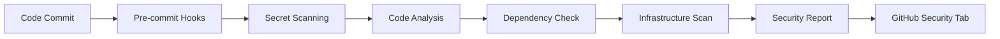

# Security Policy

## Enhanced Security Implementation

TopCards has implemented a comprehensive, multi-layered security approach with the following key enhancements:

### 🔐 Advanced Secret Detection
- **Gitleaks**: 25+ custom rules for comprehensive secret detection
- **TruffleHog**: Verified secret detection with historical scanning
- **Detect-Secrets**: Baseline-driven false positive management
- **Custom Patterns**: TopCards-specific security patterns

### 🔍 Code Security Analysis
- **Semgrep**: OWASP Top 10 + custom security rules
- **Bandit**: Python security with 50+ test types
- **ESLint Security**: JavaScript/TypeScript security rules
- **Custom Rules**: Google Cloud and Terraform security patterns

### 📦 Dependency Security
- **OWASP Dependency Check**: CVE database scanning (CVSS 8.0+ threshold)
- **Safety**: Python vulnerability scanning
- **npm audit**: Node.js dependency security
- **License Compliance**: Automated license validation

### 🏗️ Infrastructure Security
- **Checkov**: 1000+ infrastructure security policies
- **TFSec**: Terraform security best practices
- **Terrascan**: Policy as Code enforcement
- **Container Scanning**: Trivy for vulnerability detection

### ⚡ Development Security
- **Pre-commit Hooks**: 20+ security checks before commits
- **Custom Scripts**: Specialized security validation
- **Automated Workflows**: CI/CD security pipeline
- **Real-time Monitoring**: Continuous security assessment

## Supported Versions

We take security seriously and provide security updates for the following versions:

| Version | Supported          | Security Features |
| ------- | ------------------ | ----------------- |
| 2.x.x   | :white_check_mark: | Full security suite |
| 1.x.x   | :white_check_mark: | Basic security |
| < 1.0   | :x:                | Not supported |

## Reporting a Vulnerability

### 🚨 Critical Security Issues

**DO NOT** create public GitHub issues for security vulnerabilities.

### How to Report

1. **GitHub Security**: Use GitHub's private vulnerability reporting feature
2. **Email**: Contact security@topcards.dev (if configured)
3. **Direct Contact**: [@erayguner](https://github.com/erayguner)

### What to Include

- **Description**: Clear vulnerability description
- **Impact**: Potential impact and attack scenarios
- **Reproduction**: Step-by-step reproduction instructions
- **Environment**: Affected versions and configurations
- **Evidence**: Screenshots, logs, or proof-of-concept

### Response Process

1. **Acknowledgment** (≤ 24 hours)
2. **Investigation** (≤ 3 business days)
3. **Fix Development** (≤ 14 days for critical, ≤ 30 days for others)
4. **Coordinated Disclosure**
5. **Security Advisory Publication**

## Security Features

### 🛡️ Infrastructure Security

- ✅ **End-to-End Encryption**: Google Cloud KMS
- ✅ **Network Isolation**: Private subnets with firewall rules
- ✅ **Identity & Access Management**: Least privilege principles
- ✅ **Audit Logging**: Comprehensive activity tracking
- ✅ **Secret Management**: Google Secret Manager integration

### 🔒 Application Security

- ✅ **Multi-Layer Secret Detection**: 4 complementary tools
- ✅ **Static Code Analysis**: OWASP Top 10 coverage
- ✅ **Dependency Scanning**: Real-time vulnerability detection
- ✅ **Container Security**: Image and runtime scanning
- ✅ **Infrastructure as Code**: Policy enforcement

### 🔄 DevSecOps Integration

- ✅ **Pre-commit Security**: 20+ automated checks
- ✅ **CI/CD Security Pipeline**: Multi-stage validation
- ✅ **Security-First Workflows**: Automated enforcement
- ✅ **Real-time Monitoring**: Continuous threat detection
- ✅ **Incident Response**: Automated security workflows

## Security Toolchain

### Detection & Analysis
```
🔍 Gitleaks → Secret Detection (25+ custom rules)
🔍 Semgrep → Code Security (OWASP Top 10 + custom)
🔍 Bandit → Python Security (50+ tests)
🔍 TruffleHog → Verified Secrets
🔍 Checkov → Infrastructure Security
```

### Dependency & Container Security
```
📦 OWASP Dependency Check → CVE Scanning
📦 Safety → Python Vulnerabilities
📦 npm audit → Node.js Security
🐳 Trivy → Container Scanning
🐳 Hadolint → Dockerfile Security
```

### Compliance & Monitoring
```
📋 OSSF Scorecard → Security Posture
📋 License Checker → Compliance
📊 Security Workflows → Monitoring
📊 Incident Response → Automation
```

## Security Configurations

### Environment Variables

Baseline security checks run without repository secrets. Optional tokens for advanced scanning (Semgrep, TruffleHog, Gitleaks) remain disabled by default but can be re-enabled with the existing configuration files.

### Tool Configurations

| Tool | Configuration | Purpose |
|------|--------------|---------|
| MegaLinter (security flavor) | `.mega-linter.yml` | Aggregated security linting (YAML, secrets, Terraform, shell, Docker) |
| Gitleaks (via MegaLinter) | `.gitleaks.toml` | Custom secret detection baseline |
| Yamllint (via MegaLinter) | `.github/configs/yamllint.yml` | Workflow YAML validation |
| Pre-commit (local) | `.pre-commit-config.yaml` | Optional contributor safeguards |

## Security Workflows

### Automated Security Pipeline



### Security Monitoring

- **Real-time**: Continuous monitoring workflows
- **Daily**: Automated security scans
- **Weekly**: Dependency vulnerability checks
- **Monthly**: Security posture assessment

## Compliance

### Standards & Frameworks

- **OWASP Top 10**: Application security
- **CIS Benchmarks**: Infrastructure hardening
- **NIST Cybersecurity Framework**: Risk management
- **SOC 2 Type II**: Security controls

### Cloud Security

- **Google Cloud Security**: Best practices implementation
- **Shared Responsibility Model**: Clear security boundaries
- **Zero Trust Architecture**: Verify everything
- **Defense in Depth**: Multiple security layers

## Incident Response

### Automated Response

1. **Detection**: Multi-tool validation
2. **Alerting**: Immediate notifications
3. **Isolation**: Automatic containment
4. **Documentation**: Incident logging

### Manual Response

1. **Assessment**: Impact evaluation (≤ 1 hour)
2. **Containment**: Threat isolation (≤ 4 hours)
3. **Eradication**: Root cause removal (≤ 24 hours)
4. **Recovery**: Service restoration (≤ 48 hours)
5. **Lessons Learned**: Process improvement

## Security Updates

### Update Timeline

- **Critical**: Immediate (≤ 24 hours)
- **High**: Fast track (≤ 72 hours)
- **Medium**: Standard (≤ 14 days)
- **Low**: Regular release cycle

### Communication

- **Security Advisories**: GitHub Security tab
- **Release Notes**: Detailed security improvements
- **Documentation**: Updated security guides

## Contact Information

### Security Team

- **Primary**: [@erayguner](https://github.com/erayguner)
- **Issues**: GitHub Security Advisory
- **General**: GitHub Issues (non-security)

### Security Resources

- **Documentation**: `/docs/SECURITY_IMPLEMENTATION.md`
- **Configurations**: Security tool configs in repository
- **Scripts**: Custom security scripts in `/scripts/`

## Security Hall of Fame

We recognize security researchers who help improve our security:

*Be the first to help us improve TopCards security!*

---

**Security Implementation Version**: 2.0
**Last Updated**: 2025-09-20
**Next Review**: 2025-12-20

**Security Commitment**: We are committed to maintaining the highest security standards and continuously improving our security posture.
